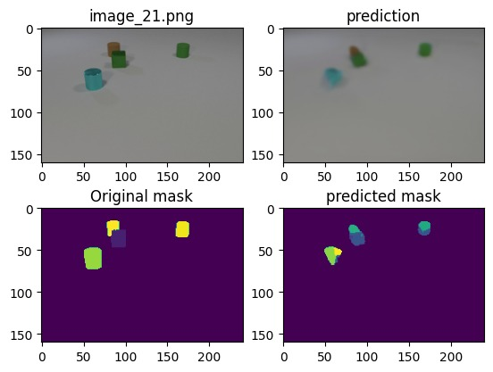

## Work Experience

Masters in Computer Science

---
## Projects
###Future Frame Segmentation Mask Prediction
Predicting the segmentation mask of the 22nd video frame given the first 11 frames using an encoder decoder based ConvLSTM and Unet Model. 
[Future Frame Segmentation Mask Prediction](/sample_page)

---
[Project 2 Title](/pdf/sample_presentation.pdf)

---
[Project 3 Title](http://example.com/)

---

### Category Name 2

- [Project 1 Title](http://example.com/)
- [Project 2 Title](http://example.com/)
- [Project 3 Title](http://example.com/)
- [Project 4 Title](http://example.com/)
- [Project 5 Title](http://example.com/)

---

---
